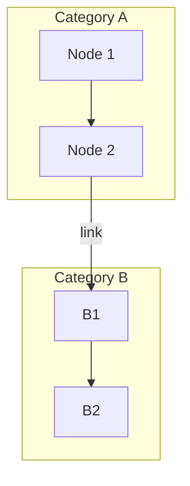

# VizFlow ✨

<p align="center">
  
  
  
  
</p>

**VizFlow is a web-based tool that instantly transforms Mermaid graph definitions into beautiful, interactive visualizations.**

An interactive, real-time graph visualization tool that parses Mermaid syntax (`graph TD`) from `.md` files and renders it as a dynamic, explorable chart using ECharts.

---

<p align="center">
  <em>(Here you can add a screenshot of the application)</em>
  <br>
  
</p>

---

## 🌟 Features

- **Mermaid to ECharts**: Automatically parses `graph TD` syntax within ```mermaid blocks.
- **File Upload**: Easily upload your `.md` files to visualize them instantly.
- **Default Visualization**: Loads a default, complex graph on startup for immediate demonstration.
- **Interactive Graph**: 
  - **Pan & Zoom**: Freely navigate large and complex graphs.
  - **Node Highlighting**: Hover over or search for a node to highlight it and its adjacent connections.
  - **Labeled Edges**: Displays labels on connections, if defined.
- **Subgraph Support**: Visually groups nodes belonging to the same first-level `subgraph` with distinct colors and a clear legend.
- **Advanced UI Controls**:
  - **Search**: Fuzzy search for nodes by their names with a dropdown list.
  - **View Controls**: Dedicated buttons for Zoom In, Zoom Out, Reset View, and toggling Pan mode.
- **Polished UI/UX**: A clean, modern interface with a responsive layout, custom-styled components, and helpful tooltips.

## 🚀 Quick Start (For Developers)

Follow these steps to get the project running locally.

1.  **Clone the repository:**
    ```bash
    git clone <your-repository-url>
    cd react-echarts
    ```

2.  **Install dependencies:**
    ```bash
    npm install
    ```

3.  **Run the development server:**
    ```bash
    npm run dev
    ```

4.  Open [http://localhost:3000](http://localhost:3000) in your browser.

## 📖 Usage (For Users)

1.  **Open the application** in your browser.
2.  You will see a default graph visualization when the page loads.
3.  To visualize your own graph, click the **"Upload File"** button.
4.  Select a `.md` file from your computer that contains a Mermaid `graph TD` definition.

#### Supported File Format:

Your `.md` file should contain a block like this:

````markdown
# My Graph


````

## 🛠️ Tech Stack

- **Framework**: [Next.js](https://nextjs.org/) (React)
- **Charting Library**: [Apache ECharts](https://echarts.apache.org/)
- **Language**: [TypeScript](https://www.typescriptlang.org/)
- **Styling**: Inline CSS & CSS-in-JS

## ☁️ Deployment

To deploy this application to a production environment, follow these steps:

1.  **Build the application:**
    ```bash
    npm run build
    ```

2.  **Start the production server:**
    ```bash
    npm run start
    ```

For continuous background operation, it is recommended to use a process manager like `pm2`:

```bash
npm install pm2 -g
pm2 start npm --name "vizflow" -- start
```

## ✍️ Author

- **Eddy** - [exhere519@gmail.com](mailto:exhere519@gmail.com)

## 🤝 Contributing

Contributions are welcome! If you have ideas for new features or have found a bug, please open an issue or submit a pull request.

## 📜 License

This project is licensed under the **MIT License**. See the [LICENSE](LICENSE) file for details.

---

_This README was last updated by Gemini on $(date)_
