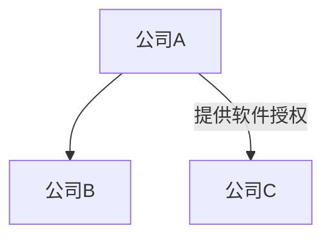

# VizFlow 用户使用手册

## 1. 引言：VizFlow 是什么？

欢迎使用 VizFlow！

VizFlow 是一款专为西门子数字工业软件售前顾问设计的产业链可视化工具。在当今复杂多变的市场环境中，快速理解一个行业生态系统、识别其中关键角色以及他们之间的供应关系，是发掘潜在客户和商机的核心。

VizFlow 旨在解决这一挑战。它能将枯燥的文本格式的供应链数据，一键转化为直观、可交互的图形化网络，帮助您：

*   **快速洞察：** 从宏观上把握整个产业链的结构。
*   **聚焦关键：** 迅速定位处于核心位置的“链主”企业或关键供应商。
*   **发现机会：** 识别出产业链中可能存在的数字化薄弱环节，这些正是西门子解决方案的潜在切入点。

简单来说，**VizFlow 是您开启数据驱动式售前咨询的第一步**，让您从繁杂的关系网中解放出来，更高效地寻找客户、理解客户、服务客户。

## 2. 核心理念：从文本到洞察

VizFlow 的核心是“化繁为简”。我们采用了一种名为 **Mermaid** 的简单文本标记语言来定义公司（节点）及其供应关系（连接线）。

您只需在一个标准的 Markdown 文件（`.md`）中，按照简单的语法规则描述一个产业链，VizFlow 就能“读懂”它并绘制出精美的图表。

例如，一段简单的描述：



就能生成一个包含三家公司及其关系的可视化图形。这意味着，您可以轻松地创建、编辑和分享您的产业链地图，而无需任何专业绘图软件。

## 3. 如何开始

访问 VizFlow 非常简单，您只需在浏览器中打开以下链接：

[https://alyxe1.github.io/VizFlow_nextjs-echarts-mermaid-viewer/](https://alyxe1.github.io/VizFlow_nextjs-echarts-mermaid-viewer/)

页面加载后，您会看到一个默认的 **“服务器液冷产业链”** 示例图。这是一个相对复杂的真实案例，您可以利用它来熟悉 VizFlow 的各项交互功能。

## 4. 核心功能详解

### 4.1. 可视化您自己的产业链地图

当您准备好分析一个新行业时，可以随时上传您自己创建的产业链地图。

1.  **点击“Upload File”按钮**：位于页面右上角。
2.  **选择文件**：在弹出的窗口中，选择您本地的 `.md` 文件。

**文件格式要求：**

*   必须是 Markdown 文件（`.md` 结尾）。
*   文件中必须包含一个 ` ```mermaid ` 代码块。
*   代码块需以 `graph TD` 开头，代表这是一个从上到下（Top-Down）的图表。
*   **定义公司：** `节点ID[公司名称]`，例如 `A[英特尔]`。
*   **定义关系：** `公司A --> 公司B` (普通连接) 或 `公司A -- "提供散热模组" --> 公司B` (带标签的连接)。

### 4.2. 探索与交互：深入洞察图谱

VizFlow 不仅仅是静态的图片，它是一个可交互的探索工具。

*   **平移与缩放 (Pan & Zoom)**
    *   **平移**：按住图表的空白区域并拖动鼠标，可以移动整个画布。
    *   **缩放**：滚动鼠标滚轮，可以放大或缩小图表，以便查看宏观结构或节点细节。您也可以使用图表右上角的 **“+”** 和 **“-”** 按钮进行精确缩放。
    *   **复位**：如果图表移动得太远，可以点击 **“Reset View”** 按钮（通常是一个“刷新”或“复位”图标）一键恢复初始视角。

*   **节点高亮 (Highlighting)**
    *   将鼠标悬停在任何一家公司（节点）上，该公司及其直接的上下游关系（一度关系）会被高亮显示，其余部分则会变暗。
    *   **亮点**：此功能对于快速聚焦于某个企业的核心生态位至关重要。您可以立刻看清“谁是它的客户？”和“谁是它的供应商？”。

*   **关系标签 (Labeled Edges)**
    *   连接线上可以显示标签，用以说明公司之间的具体合作内容，例如“提供芯片”、“软件服务”、“零部件供应”等。这为理解业务实质提供了更丰富的信息。

### 4.3. 快速定位：精准搜索

当产业链图谱非常庞大时，手动寻找一家公司会变得困难。

*   **使用搜索框**：位于页面右上角，输入您想查找的公司名称的关键字。
*   **模糊匹配**：搜索功能支持模糊匹配，您无需输入完整的公司名。
*   **下拉列表与定位**：输入时，下方会实时显示匹配结果。点击其中一个结果，图表将自动定位到该公司并高亮显示它。

### 4.4. 分类与洞察：子图与图例

*   **颜色分组 (Subgraphs)**：VizFlow 支持将不同的公司划分到不同的“子图”（Subgraph）中，并用不同的颜色加以区分。
*   **图例 (Legend)**：图表的左上角会显示图例，解释每种颜色代表的类别。
*   **业务价值**：这个功能在产业链分析中极为有用。您可以根据 **行业层级**（如 Tier 1, Tier 2 供应商）、**技术领域**（如芯片设计、服务器ODM、软件服务）或 **地域** 等维度对公司进行分组。默认的液冷产业链示例就按“层级”进行了划分，一目了然。

## 5. 西门子售前顾问专属用例

VizFlow 如何融入您的日常工作？

**第一步：绘制生态地图**
当您接触一个新的行业或客户时，首先通过公开资料、行业报告等信息，整理出关键公司及其上下游关系，并用简单的 Mermaid 语法在一个 `.md` 文件中记录下来。

**第二步：一键可视化**
将该文件上传至 VizFlow，瞬间获得整个产业链的全景视图。

**第三步：分析与机会识别**
利用交互功能进行分析：
*   **寻找“链主”**：通过观察连接线的密集程度，找到处于网络中心、影响力最大的核心企业。这些企业通常是数字化转型的关键决策者。
*   **识别“断点”**：观察是否存在某些环节，其上下游的数字化水平严重脱节？例如，一家先进的制造商（可能已是西门子的客户）其上游供应商却还在使用传统的设计和生产方式。这便是 **向上游延伸销售** 的绝佳机会。
*   **发现“空白”**：图谱中是否存在某些领域，西门子的解决方案尚未覆盖，但竞争对手已经进入？这为您提供了明确的竞争目标。

**第四步：精准匹配方案**
在识别出潜在客户后，您可以结合其在产业链中的角色（例如，是从事产品设计、生产制造还是仿真测试？），精准地从西门子 Xcelerator 产品组合中匹配最合适的解决方案（如 NX, Teamcenter, Simcenter, Calibre 等）。

## 6. 技术一瞥

VizFlow 采用了一系列现代 Web 技术构建，确保了流畅的用户体验和强大的功能：

*   **前端框架**: [Next.js](https://nextjs.org/) (基于 React)，提供了高性能的服务端渲染和静态站点生成能力。
*   **图表引擎**: [Apache ECharts](https://echarts.apache.org/)，一个功能强大、应用广泛的数据可视化库。
*   **开发语言**: [TypeScript](https://www.typescriptlang.org/)，为代码的健壮性和可维护性提供了保障。

我们致力于通过先进的技术，为您提供最简单、最直观的工具。

---

* 作者: Eddy Er
